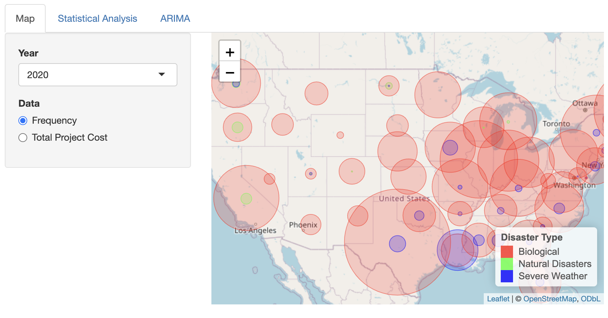

# Project 2: Shiny App Development

### [Project Description](doc/project2_desc.md)

Term: Spring 2024



## U.S. Disaster Analysis

+ **Team 4**
+ **Team Members**:
	+ Tianyi Xia
	+ Yang Yu
	+ Shoufei Meng
	+ Xiangjing Hu

+ **Project summary**: The project focuses on exploratory data analysis and visualization of US disaster information, encompassing the frequency of different disaster types and associated project costs across states, aiming to examine the short-term and long-term parttern of disaster happend in the US. We developed a shiny app that enable users to select a specific year, which then displays the frequency and cost data on the US map. The app also features histograms and ARIMA (AutoRegressive Integrated Moving Average) plots to provide detailed insights into disaster trends and financial impacts. This tool aims to enhance understanding and awareness of disaster patterns and their economic ramifications in the United States.

+ **Shiny App Link**: [https://helena-hu.shinyapps.io/US_Disaster_Shiny/](https://helena-hu.shinyapps.io/US_Disaster_Shiny/)

+ **Contribution statement**: All team members contributed equally in all stages of this project. All team members approve our work presented in this GitHub repository including this contributions statement. We came up with the problem we wanted to study and filtered the appropriate dataset based on the problem. Shoufei Meng and Yang Yu pre-processed the data in the appropriate dataset. Shoufei undertaken the task of data cleansing and integration and engaged in  feature selection to identify the significant attributes of the data. Yang modeled the time series by the frequency of disasters and predicted it by a suitable ARIMA model. Tianyi is responsible for the ARIMA and descriptive statistics analysis sections in the Shiny app. For ARIMA forecasting, ACF and PACF plots are generated, along with time series forecasting and upper and lower confidence intervals. Xiangjing developed the map visualize disaster frequency and project cost of different kinds of disasters for each state in shiny app and deployed the shiny app. Xiangjing combined and organized the code and data and edit project and folder description.

Following [suggestions](http://nicercode.github.io/blog/2013-04-05-projects/) by [RICH FITZJOHN](http://nicercode.github.io/about/#Team) (@richfitz). This folder is orgarnized as follows.

```
proj/
├── app/
├── lib/
├── data/
├── doc/
└── output/
```

Please see each subfolder for a README file.

